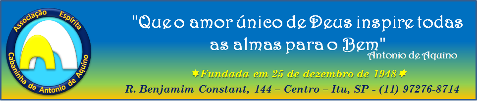
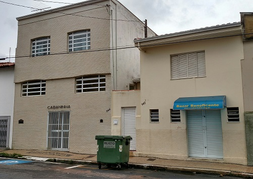
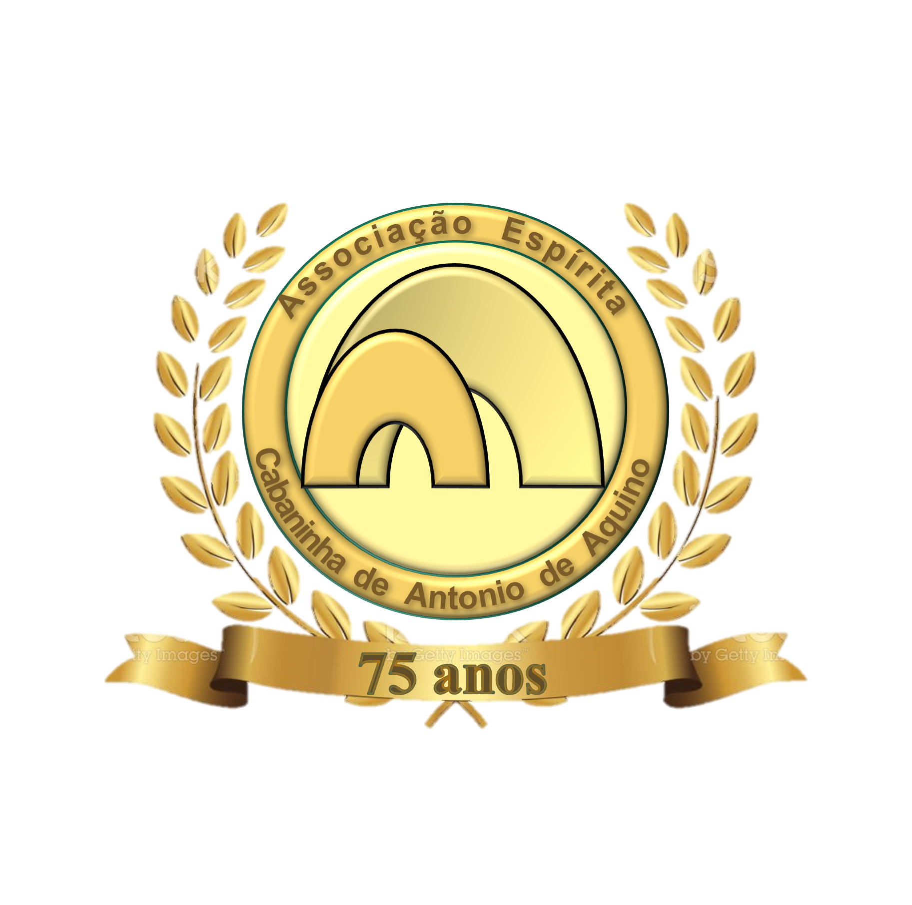

# Cabaninha!

## Inicial / Home

Agenda da semana
* Preleções [Acesso a lista de preleções](prelecoes)
* Eventos
* [Cursos](cursos)
* Reuniões

Conteúdo do boletim informativo da semana atual.

## Quem somos

* Porque cabaninha
* Porque fazemos
* O que fazemos.
* Associe-se

## 75 anos de Cabaninha

## Doutrina e conteúdo

### Programa de palestras

Duas tabelas, a primeira com as palestras da semana corrente
E uma segunda tabela com o histórico das preleções

## Cursos

Lista com a descrição dos cursos
Descrição dos cursos

### Biblioteca

Disponbilizar a lista de livros as disposição para venda e empréstimo.

## Assistencial

### Cáritas

### Enxoval - Valéria Amantéa

## Social Eventos

### Eventos agendados
Eventos agendados

### Histórico de eventos
Histórico de eventos com descrição e se possível fotos, analiser LGPD

### Bazar

## Mensagens

As mensagens atuais e mais as que fossem aprovadas.

## Boletim informativo

Historico e conteúdo como em um blog.
[Acesso o histórico de boletins](boletins)

## Contato

Um formulario enviando mensagens para a cabaninha bem como links para os números difernetes do WhatsApp.

## Estatuto

Acesse o estatuto da associação em: [estatuto](estatuto)
